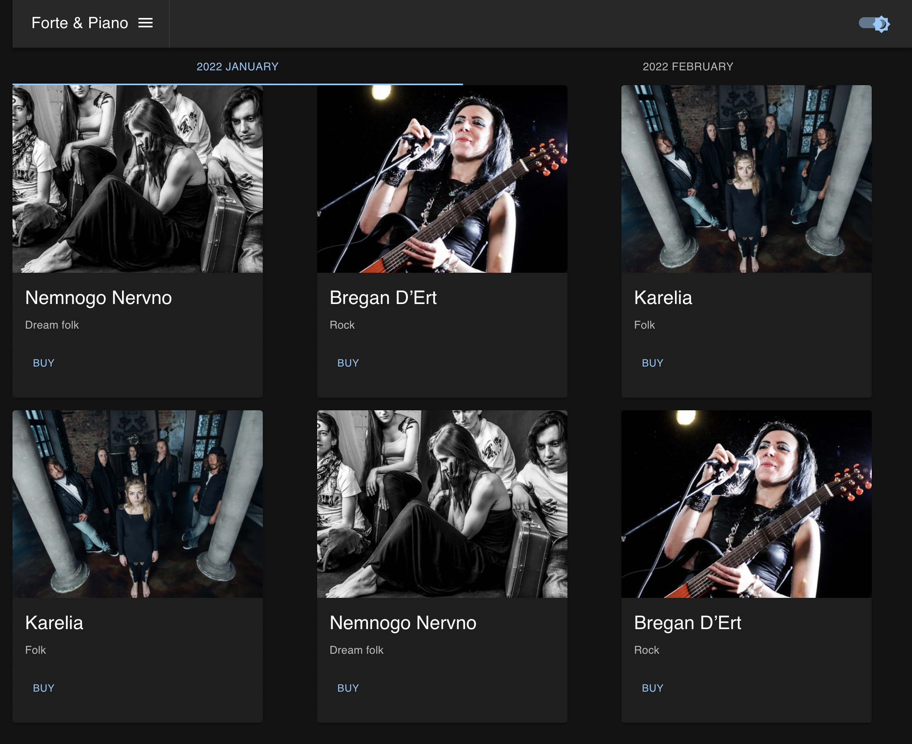
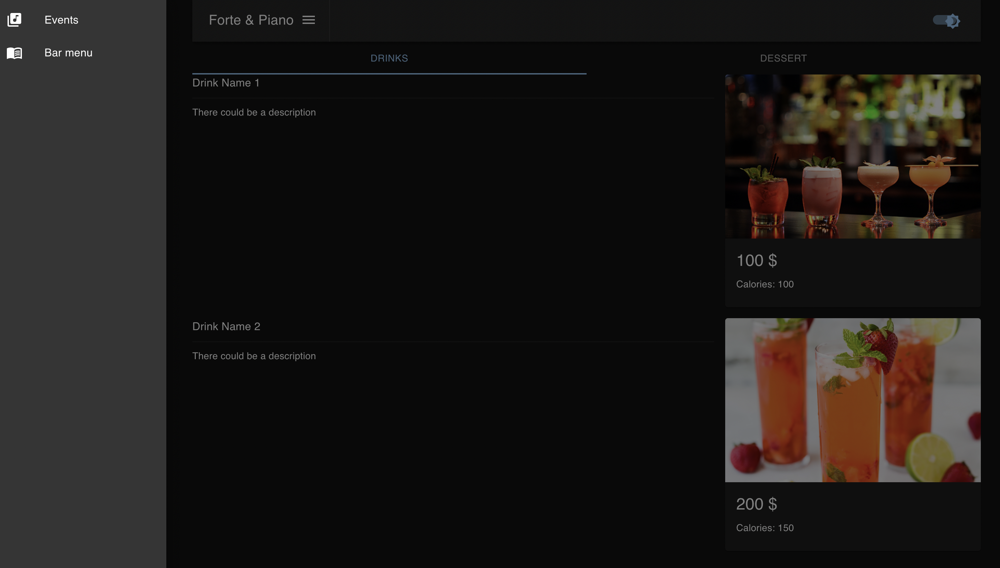

# Kotlin Multiplatform. Full Stack Web App.

## Description
This one is a sample (and also simple) website representing a nonexistent music club named Forte & Piano.
The project demonstrates how front-end (client) and back-end (server) parts of the web app can be implemented with Kotlin.

## Tech stack
HTTP intercommunication implemented with Ktor.
Front-end part implemented with vanilla React. For styled components used Material UI.
Mongodb used as a data storage.

### Alpha
For now, multiplatform projects are in Alpha. Language features and tooling may change in future Kotlin versions.

## Run
To run this project you need to start db and run app.

### Start database
`docker-compose up`

### Run application
#### Command line 
`./gradlew run`
#### IDE (e.g. Intellij idea)
Gradle panel. Tasks -> application -> run

### Pictures

